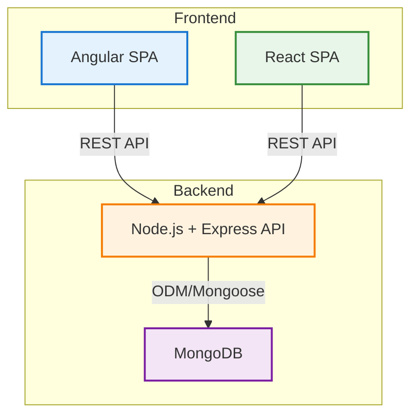
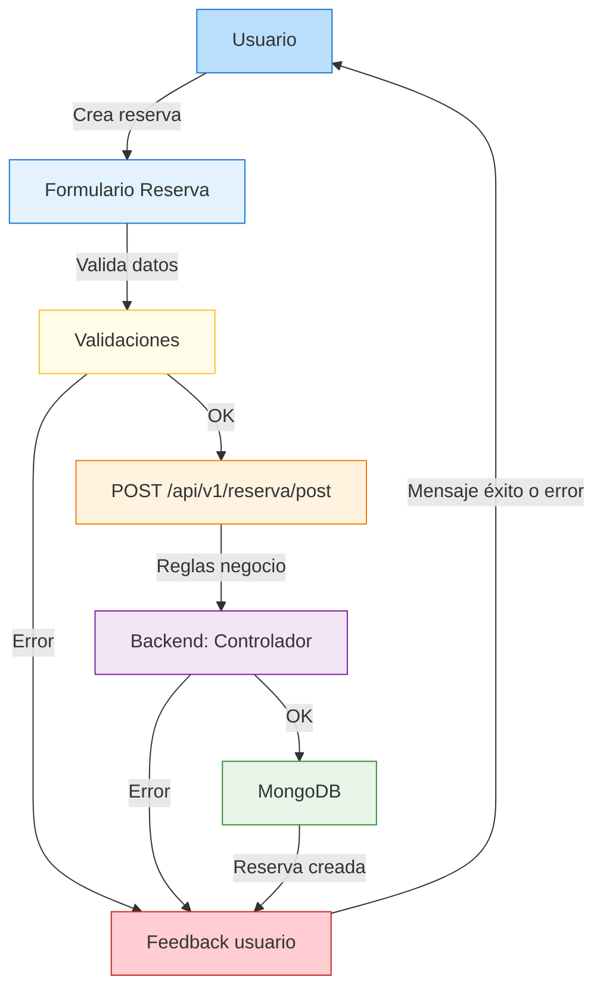

# Diagramas del sistema

## Diagrama de arquitectura

**Descripción:**
Ambos frontends (Angular y React) consumen la misma API REST Node.js/Express, que a su vez gestiona la persistencia en MongoDB mediante Mongoose. Esto permite desacoplar la lógica de presentación y negocio, facilitando la escalabilidad y el mantenimiento.

## Diagrama de flujo: creación de reserva

**Descripción:**
El usuario completa el formulario de reserva. El frontend valida los datos y muestra feedback inmediato. Si todo es correcto, se envía la petición a la API, donde se aplican reglas de negocio (stock, fechas, duplicados). El backend responde con éxito o error, y el frontend informa al usuario.
